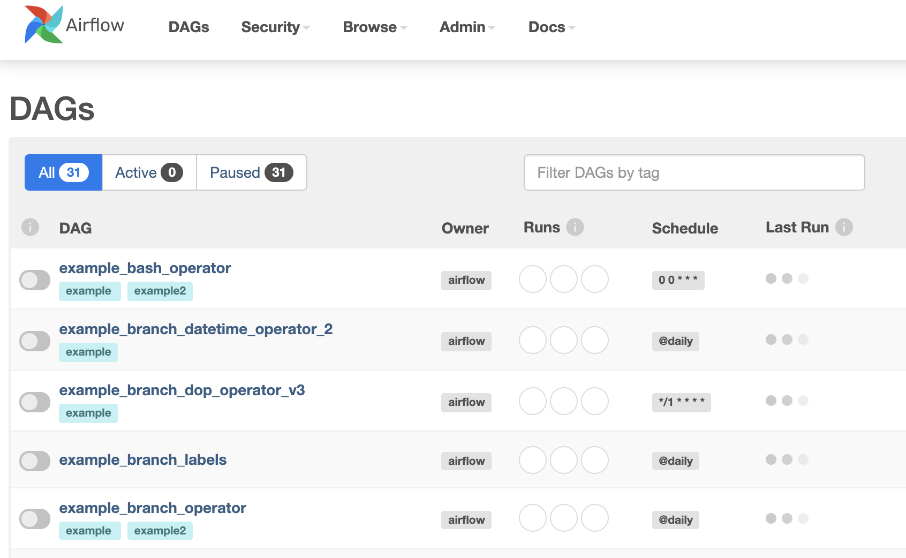

# Install and initialize Airflow

In this step, you will install the Apache Airflow Python package in your environment and initialize the configuration.

## Installation

Install the Airflow package by running the following command in the Terminal:

`pip install apache-airflow --ignore-installed`{{execute}}

Note that we use the `--ignore-installed` flag here to avoid some version conflicts with package dependencies.

## Initializing Airflow

Airflow uses a relational database as a backend to store configuration data. By default, this is a SQLite database, which will be stored in `~/airflow/airflow.db`. You initialize the database in your environment by running the following command in the terminal:

`airflow db init`{{execute}}

Next, you need to create a user that can log into the Airflow UI. Enter the following in your terminal to create a user named *admin* with admin permissions:

```bash
airflow users create \
    --username admin \
    --firstname Firstname \
    --lastname Lastname \
    --role Admin \
    --email admin@example.org \
    --password password
```{{execute}}

If successful, you will see the output `Admin user admin created`.

## Running the webserver and scheduler

To confirm that the configuration works correctly, you can run the Airflow webserver and scheduler and log into the UI. Execute the following commands in the terminal to start the webserver and scheduler:

`airflow webserver --port 8080 -D`{{execute}}

`airflow scheduler`{{execute}}

This runs the Airflow web UI at port `8080`. In order to access the web UI, open the [Airflow web UI](http://[[HOST_SUBDOMAIN]]-8080-[[KATACODA_HOST]].environments.katacoda.com){:target="_blank"} in a new tab or window. You may need to wait while the webserver is starting up.

Once loaded, you will see the Airflow web UI login page. Enter the user credentials you just created:
* Username: admin
* Password: password

If set up successfully, you will see the Airflow web UI with a list of sample DAGs, as shown in this screenshot:



Return to the **Terminal tab** and use `CTRL+C` to shut down the scheduler process.

In the next step, you will create a project with a new DAG.
